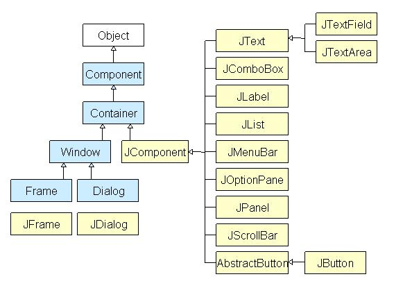
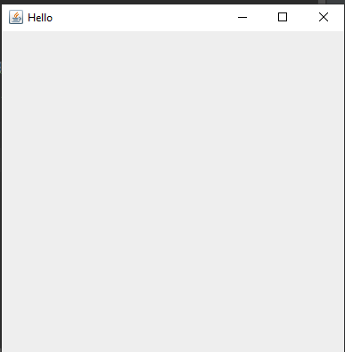
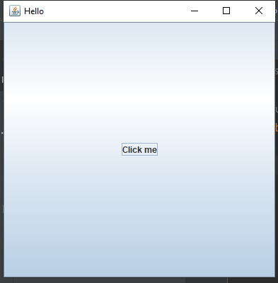
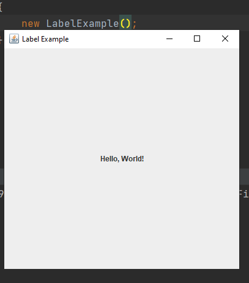
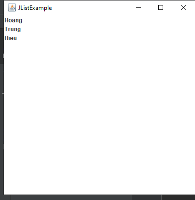
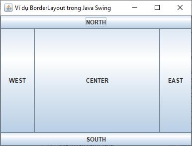
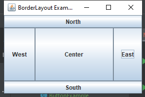
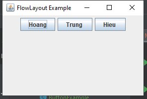
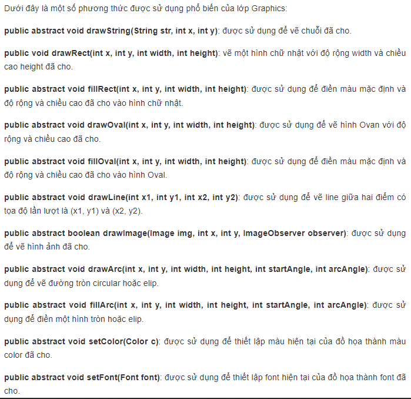

 #  [JAVA] BUỔI 12: CÁC NGUYÊN TẮC THIẾT KẾ, MÔ HÌNH THIẾT KẾ
 
 ***
## 1. THƯ VIỆN ĐỒ HOẠ SWING

>*Tài liệu tham khảo*:  [SWING](https://t3h.com.vn/tin-tuc/java-swing)


\- **Swing** là thư viện các đối tượng để lập trình giao diện đồ hoạ trong Java. Trước đây thư viện AWT là thư viện tiêu chuẩn cho lập trình giao diện, sau này Swing được phát triển kế thừa một số lớp của AWT, hoạt động nhẹ hơn và độc lập với nền tảng thiết bị, và bổ sung thêm nhiều lớp hiển thị mạnh mẽ hơn.

\- Mỗi thành phần trong Swing được gọi là component. Component được chia làm 2 loại:

-   Loại khung chứa: là những component định nghĩa khung chứa các component khác bên trong. Các component loại này ko thực hiện chức năng hiển thị nội dung, mà chỉ định nghĩa kích thước, nền, cách sắp xếp và hiển thị các component bên trong. Các component khung chứa thường dùng như JFrame, JPanel, JDialog, …

-   Loại hiển thị: là những component đơn vị thực hiện chức năng hiển thị nội dung. Các component hiển thị thường dùng như JLabel, JButton, JList, JTextField, …

**Sơ đồ phân cấp lớp Java Swing**

Tất cả các thành phần trong Java Swing là JComponent có thể được thêm vào các lớp vùng chứa.



## 2: JFrame, JButton, JLabel, JTextField, JTable, JList (Component)

>*Tài liệu tham khảo*:  [JAVA SWING](https://www.youtube.com/watch?v=oat60CQiAW0)


### 2.1: JFrame
- Là 1 loại Container
- Cung cấp không gian cho các component bên trong hoạt động
- Giống như 1 cửa sổ window có tiêu đề và viền

```

public class Hello {
    public Hello()
    {
        JFrame frame = new JFrame("Hello");
        frame.setSize(400,400); // chieu dai,rong
        frame.setVisible(true);            // chieu len man hinh, tuongtac
        frame.setDefaultCloseOperation(JFrame.EXIT_ON_CLOSE); // Khi dong khung cua so -> Chuong trinh dong theo
    }
}

public class Main {
    public static void main(String[] args)
    {
        new Hello();
    }
}
```




### 2.2: JButton

\- JButton trong Java là một thành phần giao diện người dùng (GUI) thuộc thư viện Swing, được sử dụng để tạo ra một nút có thể nhấp. JButton cho phép người dùng tương tác với ứng dụng của bạn bằng cách nhấp vào nút để kích hoạt một hành động nào đó.

```
import javax.swing.*;

public class Hello {
    public Hello()
    {
        JFrame frame = new JFrame("Hello");
        frame.setSize(400,400);
        frame.setDefaultCloseOperation(JFrame.EXIT_ON_CLOSE);

        JButton button = new JButton("Click me");

        frame.add(button);
        frame.setVisible(true);

    }
}
```


### 2.3: JLabel

\- Trong Java, **JLabel** là một thành phần giao diện người dùng (GUI) được sử dụng để hiển thị văn bản hoặc hình ảnh không thể chỉnh sửa. **JLabel** thường được sử dụng để cung cấp thông tin hoặc nhãn cho các phần khác của giao diện người dùng.

```
import javax.swing.*;

public class LabelExample {
        public LabelExample() {
            // Tạo một JFrame
            JFrame frame = new JFrame("Label Example");
            frame.setSize(300, 200);
            frame.setDefaultCloseOperation(JFrame.EXIT_ON_CLOSE);

            // Tạo một JLabel mới với văn bản "Hello, World!"
            JLabel label = new JLabel("Hello, World!",JLabel.CENTER);

            // Thêm JLabel vào JFrame
            frame.getContentPane().add(label);

            frame.setVisible(true);
        }
}
public class Main {
    public static void main(String[] args)
    {
        new LabelExample();
    }
}
```


### 2.4: JTextField

\- Trong Java, **JTextField** là một thành phần giao diện người dùng (GUI) được sử dụng để cho phép người dùng nhập văn bản hoặc dữ liệu ngắn. **JTextField** thường được sử dụng trong các biểu mẫu và các trường nhập liệu trong ứng dụng.

```
import javax.swing.*;

public class TextFieldExample {
    public TextFieldExample() {
        // Tạo một JFrame
        JFrame frame = new JFrame("Text Field Example");
        frame.setSize(300, 200);
        frame.setDefaultCloseOperation(JFrame.EXIT_ON_CLOSE);

        // Tạo một JLabel để hiển thị hướng dẫn cho người dùng
        JLabel label = new JLabel("Enter your name:");

        // Tạo một JTextField với kích thước 20 ký tự
        JTextField textField = new JTextField(20);

        // Căn chữ vào trung tâm của JTextField
        textField.setHorizontalAlignment(JTextField.CENTER);

        // Thêm JLabel và JTextField vào JFrame
        frame.getContentPane().add(label);
        frame.getContentPane().add(textField);

        frame.setVisible(true);
    }
}
```

### 2.5: JTable

\- Trong Java, **JTable** là một thành phần giao diện người dùng (GUI) được sử dụng để hiển thị dữ liệu dưới dạng bảng có cấu trúc. **JTable** cung cấp một cách hiệu quả để hiển thị và quản lý dữ liệu theo cột và hàng.

```
import javax.swing.*;
import javax.swing.table.DefaultTableModel;

public class TableExample {
    public TableExample() {
        // Tạo một JFrame
        JFrame frame = new JFrame("Table Example");
        frame.setDefaultCloseOperation(JFrame.EXIT_ON_CLOSE);

        // Dữ liệu mẫu cho bảng
        Object[][] data = {
                {"John", 25, "Male" },
                {"Alice", 30, "Female"},
                {"Bob", 35, "Male"}
        };

        // Tiêu đề của các cột
        Object[] columns = {"Name", "Age", "Gender"};

        // Tạo một DefaultTableModel để quản lý dữ liệu của bảng
        DefaultTableModel model = new DefaultTableModel(data, columns);

        // Tạo một JTable với DefaultTableModel
        JTable table = new JTable(model);

        // Thêm bảng vào JScrollPane để cuộn nếu cần
        JScrollPane scrollPane = new JScrollPane(table);
        frame.add(scrollPane);

        // Đặt kích thước của JFrame tự động phù hợp với nội dung
        frame.pack();

        frame.setVisible(true);
    }
}

```
\-  Ta tạo một bảng đơn giản với các dữ liệu mẫu như tên, tuổi và giới tính của ba người. 
\- Ta sử dụng DefaultTableModel để quản lý dữ liệu của bảng và truyền nó vào JTable.
\-  Ta đặt bảng trong một JScrollPane để cho phép cuộn nếu kích thước bảng lớn hơn kích thước của cửa sổ.

### 2.6: JList

\- Trong Java, **JList** là một thành phần giao diện người dùng (GUI) được sử dụng để hiển thị một danh sách các mục. **JList** cho phép người dùng chọn một hoặc nhiều mục từ danh sách đó.

```
import javax.swing.*;
public class JlistExample {
    public JlistExample() {
        JFrame frame = new JFrame("JListExample");

        String[] data = {"Hoang", "Trung", "Hieu"};
        JList<String> list = new JList<>(data);

        frame.add(list);

        frame.setSize(400, 400);
        frame.setVisible(true);
        frame.setDefaultCloseOperation(JFrame.EXIT_ON_CLOSE);
    }
}
```


## 3: BorderLayout, FlowLayout, GridLayout ( LayoutManager)

### 3.1: BorderLayout

\- Trong Java, **BorderLayout** là một trong các LayoutManager được sử dụng để quản lý việc định vị các thành phần (components) trên một container, như JFrame hoặc JPanel. BorderLayout chia container thành năm khu vực (vùng): North, South, East, West và Center. Mỗi khu vực có thể chứa một thành phần duy nhất, và các thành phần này sẽ căn chỉnh theo vị trí tương ứng trong container.



```
import javax.swing.*;
import java.awt.*;

public class BorderLayoutExample {
    public BorderLayoutExample() {
        // Tạo một JFrame
        JFrame frame = new JFrame("BorderLayout Example");

        // Thiết lập layout cho JFrame là BorderLayout
        frame.setLayout(new BorderLayout());

        // Thêm các thành phần vào JFrame với các vị trí tương ứng
        frame.add(new JButton("North"), BorderLayout.NORTH);
        frame.add(new JButton("South"), BorderLayout.SOUTH);
        frame.add(new JButton("East"), BorderLayout.EAST);
        frame.add(new JButton("West"), BorderLayout.WEST);
        frame.add(new JButton("Center"), BorderLayout.CENTER);

        // Thiết lập kích thước của JFrame và hiển thị nó
        frame.setSize(300, 200);
        frame.setDefaultCloseOperation(JFrame.EXIT_ON_CLOSE);
        frame.setVisible(true);
    }
}

```


### 3.2:FlowLayout

>*Tài liệu tham khảo*:  [FlowLayout](https://viettuts.vn/java-swing/flowlayout-trong-java-swing)


\- Trong Java, **FlowLayout** là một trong các LayoutManager được sử dụng để quản lý việc định vị các thành phần (components) trên một container. Nó sắp xếp các thành phần theo thứ tự từ trái qua phải, từ trên xuống dưới, tự động xuống dòng khi không đủ không gian.

```
import javax.swing.*;
import java.awt.*;

public class FlowLayoutExample {
    public FlowLayoutExample() {
        // Tạo một JFrame
        JFrame frame = new JFrame("FlowLayout Example");

        // Tạo một JPanel và thiết lập layout của nó là FlowLayout
        JPanel panel = new JPanel();
        panel.setLayout(new FlowLayout());

        // Thêm các thành phần (JButton) vào JPanel
        panel.add(new JButton("Hoang"));
        panel.add(new JButton("Trung "));
        panel.add(new JButton("Hieu "));

        // Thêm JPanel vào JFrame
        frame.add(panel);

        // Thiết lập kích thước của JFrame và hiển thị nó
        frame.setSize(300, 200);
        frame.setDefaultCloseOperation(JFrame.EXIT_ON_CLOSE);
        frame.setVisible(true);
    }
}

```




### 3.3: FlowLayout

>*Tài liệu tham khảo*:  [FlowLayout](https://viettuts.vn/java-swing/flowlayout-trong-java-swing)


\- **GridLayout** là một trong những LayoutManager cơ bản trong Java Swing, được sử dụng để sắp xếp các thành phần của giao diện người dùng (UI) thành một lưới hình chữ nhật, trong đó mỗi thành phần được đặt vào một ô trong lưới.

\- **GridLayout** chia không gian được cung cấp cho nó thành một lưới có số hàng và số cột xác định. Tất cả các ô trong lưới có cùng kích thước.


```
import javax.swing.*;
import java.awt.*;

public class GridLayoutExample {
    public GridLayoutExample() {
        JFrame frame = new JFrame("GridLayout Example");
        frame.setDefaultCloseOperation(JFrame.EXIT_ON_CLOSE);

        // Tạo một JPanel để chứa các thành phần
        JPanel panel = new JPanel(new GridLayout(3, 3)); // Sử dụng GridLayout 3x3

        // Thêm các JButton vào JPanel
        for (int i = 1; i <= 9; i++) {
            JButton button = new JButton("PIC " + i);
            panel.add(button);
        }

        // Thêm JPanel vào JFrame
        frame.getContentPane().add(panel);

        frame.pack(); // Đặt kích thước của JFrame tự động phù hợp với nội dung
        frame.setVisible(true);
    }
}
```
## 4: Graphics2D, Image

### 4.1: Lớp Graphics trong Java Swing

>*Tài liệu tham khảo*:  [Graphics ](https://viettuts.vn/java-swing/lop-graphics-trong-java-swing)

\- Lớp **Graphics** trong Java cung cấp nhiều phương thức để lập trình đồ họa.




```
import java.awt.*;
import javax.swing.*;

public class DrawRectExample extends JFrame {
    public DrawRectExample() {
        setTitle("Draw Rectangle Example");
        setSize(300, 200);
        setDefaultCloseOperation(JFrame.EXIT_ON_CLOSE);
        setLocationRelativeTo(null);
        setVisible(true);
    }

    public void paint(Graphics g) {
        super.paint(g);
        Graphics2D g2d = (Graphics2D) g;
        g2d.drawRect(50, 50, 100, 80); // Vẽ hình chữ nhật từ (50, 50) với kích thước 100x80
    }

    public static void main(String[] args) {
        new DrawRectExample();
    }
}

```

4.2:Image

>*Tài liệu tham khảo*:  [Image](https://viettuts.vn/java-swing/lop-imageicon-trong-java-swing)